# News Sentiment Analysis and Crypto Price Prediction (Dogecoin and Bitcoin)

 

## Description
Tweets, News, Social Media updates and online discussions  plays an important role in impacting the decisions of individual investors. More importantly the news of a particular stock sets the tone of emotions and could drive the price trend either upwards or downwards. 

#### Why we chose this topic :
In the past few years we have seen Crypto and Meme Stocks usually tend to be impacted by news and social media activity, example when Elon Musk tweeted about Dogecoin it saw a dramatic upward swing in price. Taking this into consideration we wanted to analyze News Sentiment on Crypto prices.

#### This project will focus on :

a) Analysis of Sentiment of News of Dogecoin and Bitcoin

b) Evaluate and Analyze through Machine learning models on how the news sentiment impacts the future price of Dogecoin and Bitcoin

---
## Table of Contents
* [Description](#description)
* [Goals](#goals)
* [Technologies](#technologies)
* [News Sentiment](#News-Sentiment)
* [Closing Prices and Title Compound Trend](#Closing-Prices-and-Title-Compound-Trend)
* [Machine Learning Models (Methodology)](#Machine-Learning-Models-Methodology)
* [Machine Learning Models (Results)](#Machine-Learning-Models-Results)
* [Conclusion](#Conclusion)
* [Contributors](#contributors)
* [References and Resources](#references-and-resources)
* [License](#license)

---
## Goals
Our goal is to answer these 4 questions: 

* What is the news sentiment of Dogecoin and Bitcoin in the past one month ?
* How does News Sentiment correlate to the closing prices of Dogecoin and Bitcoin ?
* How do Classification and Regression models compare in future prediction ?
* What should investors consider in future investment decisions ? 

## Technologies & Libraries
Our portfolio analysis will use the following technologies and libraries: 
* NewsAPI
* VaderSentimentAnalysis
* sklearn
* TensorFlow
* XGBoost (New model used)
* pandas
* plotly
* numpy
* datetime
* pathlib
* seaborn
* hvplot
* matplotlib
* Yahoo Finance 

---
  
  

## News Sentiment
* We used NewsAPI to gather the daily news of Dogecoin and Bitcoin over the past one month covering 100 articles each</b>
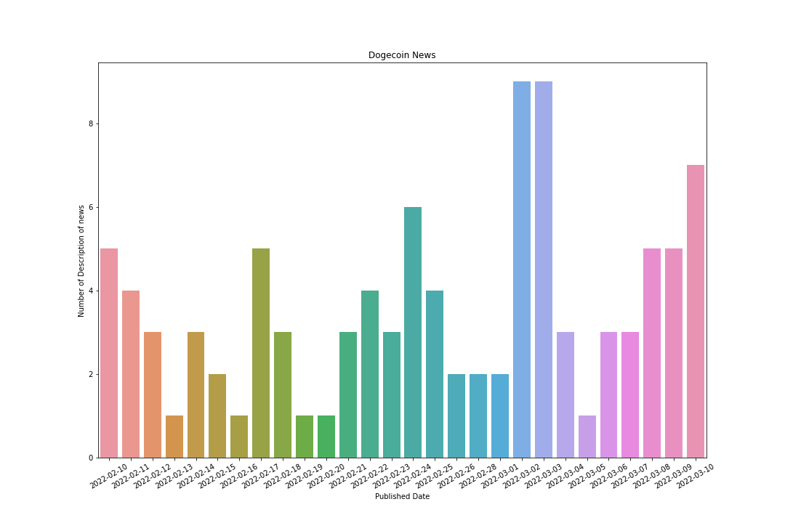

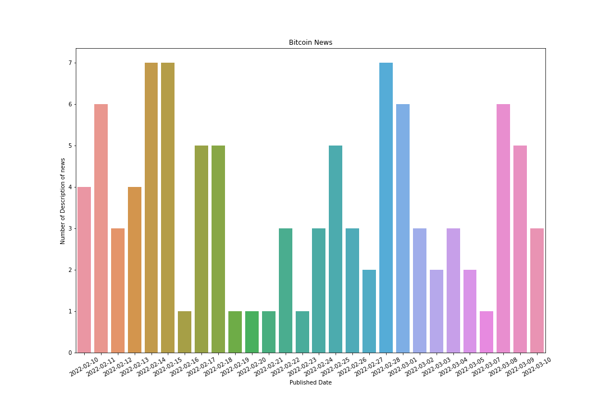

* After gathering the news we used VADER SENTIMENT ANALYSIS and focussed mainly on Title Compound and Title Sentiment.</b>

Dogecoin had 15 Neutral, 11 Negative and 3 Positive Sentiment</b>

Bitcoin had 16 Negative, 10 Neutral and 3 Positive Sentiment
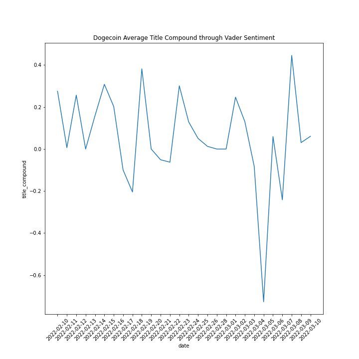

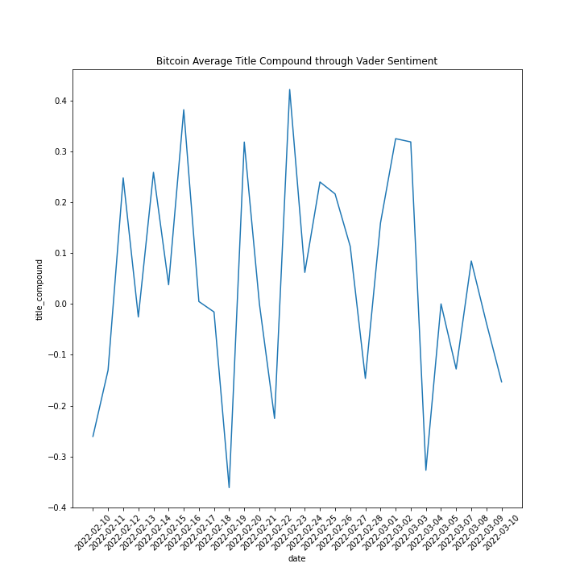

---
## Closing Prices and Title Compound Trend
* <b>Dogecoin Closing Prices and Title Compund Trend</b>: 
Correlation of Title Compound Average to Closing prices is 0.2748  

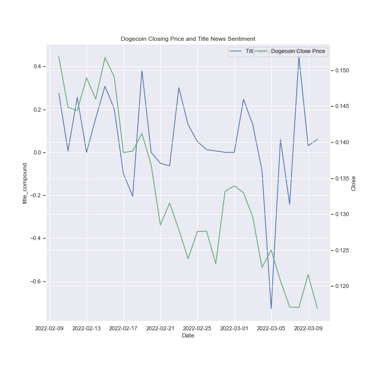 

* <b>Bitcoin Closing Prices and Title Compund Trend</b>: 
Correlation of Title Compound Average to Closing prices is 0.0991.  

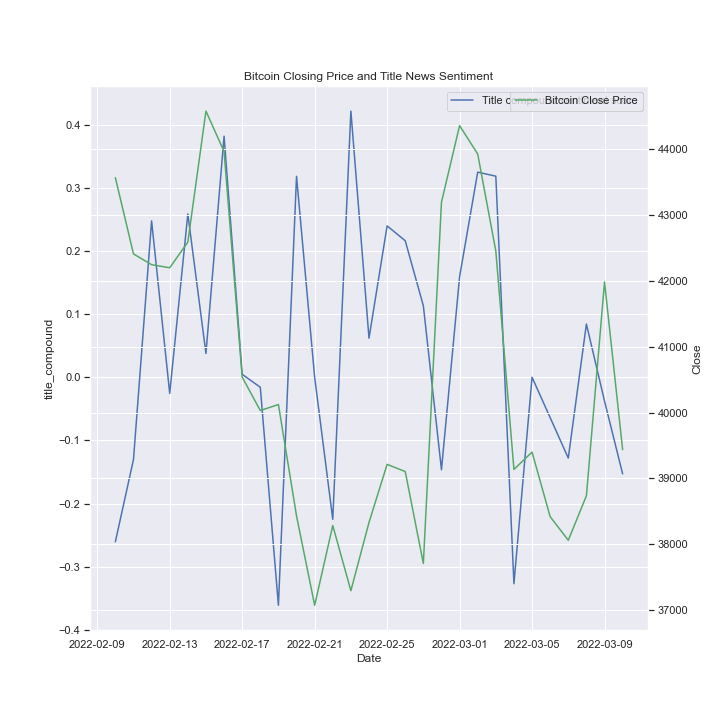 

---
## Machine Learning Models Methodology

## A) Classification Methodology

As part of the data organization under classification methodology, we used the title sentiment score basis Vader Sentiment technique to classify the title sentiment into positive, neutral and negative sentiment. Then we used the daily closing prices of Dogecoin and Bitcoin and converted it to a binary form (0 or 1). 0 signifies the closing price is less or equal than the previous day and 1 signifies that the value is greater than the day before. 

* <b>Logistic Regression</b>: The logistic regression model is used to model the dependent variable(Closing prices of Dogecoin and Bitcoin) and one or more independent variables(News Sentiment)  by estimating probabilities using a logistic regression equation. Thus we used logistic regression to predict whether crypto price might go up or down depending on the news sentiment.

* <b>Random Forest Classifier</b>: Random forests or random decision forests is an ensemble learning method for classification and can be used to rank the importance of variables in a natural way. We used this model with key variables such as close price, news sentiment and volume to predict the close price trend and understand which variables have the most effect on the prediction.

## B) Regression Methodology

As part of the data organization under regression methodology, we used title sentiment to predict closing price. Also, we used a new machine learning model known as XGBoost Regressor Model and increased the feature set by including the volume and closing price percentage change in the feature set.

* <b>LSTM RNN</b>: LSTM stands for Long-Short Term Memory and is a type of recurrent neural network. LSTM networks are well-suited to classifying, processing and making predictions based on time series data. We used this  model to predict the closing prices of crypto based on time series of news sentiment.

* <b>XGBoost Regressor Model</b>:
Extreme Gradient Boosting (XGBoost) is an open-source library that provides an efficient and effective implementation of the gradient boosting algorithm. We used this model to enhance the feature set and predict the crypto prices.

---
## Machine Learning Models Results

## A) Results for Dogecoin

### Classification Models

* <b>Logistic Regression</b>: We have an accuracy score of 0.57

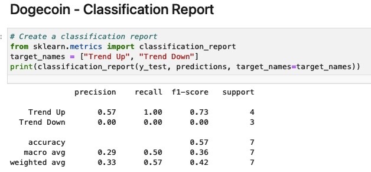 

* <b>Random Forest Classifier </b>: 

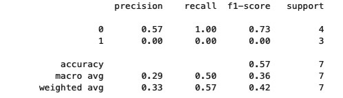 

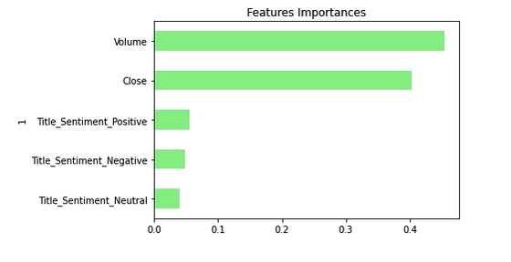 

### Regression Models

* <b>LSTM RNN</b>: RMSE 0.3828 and R-Squared -6.160

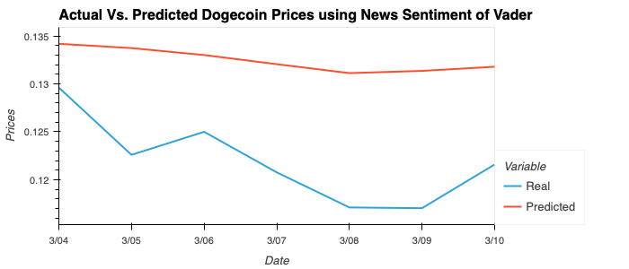  

* <b>XGBoost Regressor Model </b>: RMSE 0.2466 and R-Squared 0.4470

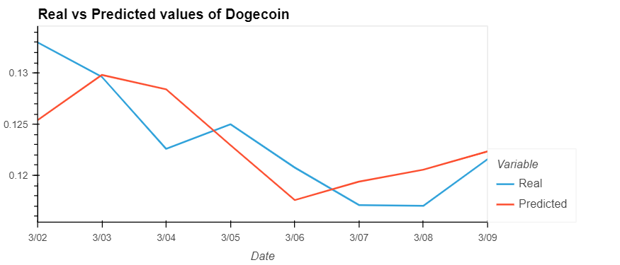  

---

## B) Results for Bitcoin

### Classification Models

* <b>Logistic Regression</b>: We have an accuracy score of 0.43

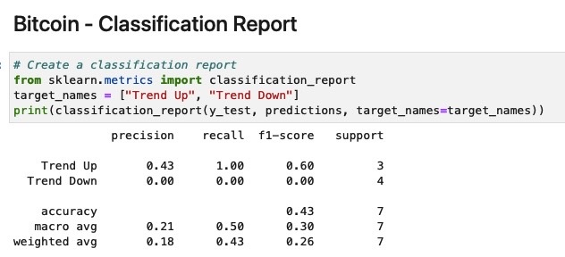

* <b>Random Forest Classifier 

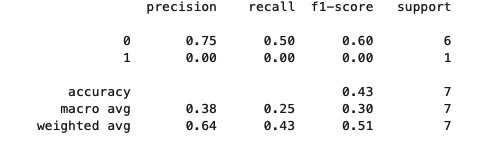 

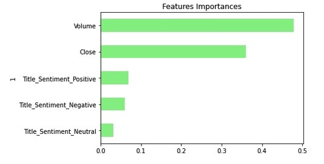 

### Regression Models

* <b>LSTM RNN</b>: RMSE 0.2279 and R-Squared -0.1107

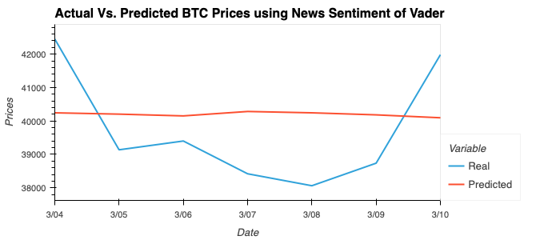  

* <b>XGBoost Regressor Model </b>: RMSE 0.2595 and R-Squared 0.4513

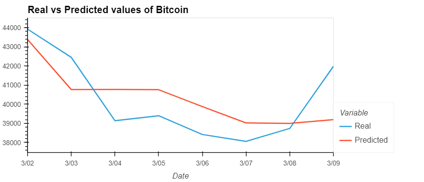  

---
## Conclusion

#### Classification Models  
    
The Dogecoin News Sentiment and Price trend prediction had a higher accuracy score compared to Bitcoin.

However with Accuracy scores in the range of 43-57%, the classification approach did not yield much confidence so as to justify usage to correlate stock movement with News Sentiments.

#### Regression Models  

Just by News Sentiment, we believe one feature is not sufficient to predict the closing price of Dogecoin or Bitcoin. As seen in the LSTM prediction both the Dogecoin and Bitcoin had a negative R-Squared. The negative R-squared value means that your prediction tends to be less accurate than the average value of the data set over time.

However as we add more features such as Crypto Volume and Daily Percentage Return we get a much more realistic model using the XGBoost Regression Model. The R-Squared improves to 0.4470 for Dogecoin and 0.4513 for Bitcoin.

---

#### What is the news sentiment of Dogecoin and Bitcoin in the past one month ?
* <b> Dogecoin :
    
Dogecoin had 15 Neutral, 11 Negative and 3 Positive Sentiment news reports.

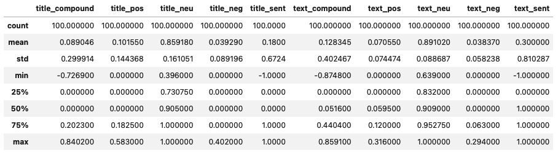  

* <b> Bitcoin :

Bitcoin had 16 Negative, 10 Neutral and 3 Positive Sentiment reports.

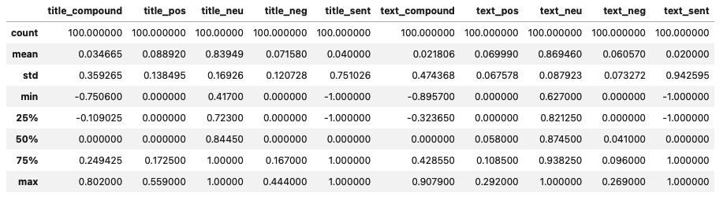    

#### How does News Sentiment correlate to the closing prices of Dogecoin and Bitcoin ?

Dogecoin had a correlation of 0.2748 between Title Compound Average to Closing prices. However it had a correlation of 0.5062 between the title sentiment to Closing prices. 
    
Bitcoin had a correlation of 0.0991 between Title Compound Average to Closing prices. However it had a correlation of -0.0981 between the title sentiment to Closing prices.  

 Thus, basis coorelation we believe that news sentiment may not be the only factor impacting prices and there will be other sources such as Twitter, Reddit, Discord or other factors apart from news or social media data that impacts price.

#### How do Classification and Regression models compare in future prediction ?
    
Classification predictive modeling problems are different from regression predictive modeling problems.Classification is the task of predicting a discrete class label. Regression is the task of predicting a continuous quantity.
    
Thus both play an important role depending on the investor's requirement.

* <b> Classification Model :<b> 

    In Classification Model, the investor should aim for a higher accuracy score. In the current model both the logsitic regression model an random forest classifier have a low accruacy score in the range of 43-57%

* <b> Regression Model : <b> 

    In Regression Model, the inverstor should compare the Root Mean Squared Error (RMSE) and R-squared (R2). RMSE measures the average error performed by the model in predicting the outcome for an observation. The lower the RMSE, the better the model. R2 is the proportion of variation in the outcome that is explained by the predictor variables. In multiple regression models, R2 corresponds to the squared correlation between the observed outcome values and the predicted values by the model. The Higher the R-squared, the better the model.
    
In this particluar study, there was no key difference between the logistic regression classifier model and random forest classifier model. However in the regression model, the XGBoost Regressor Model has a higher R-Squared compared to the LSTM model.
    

#### What to consider in future investment decisions? 
News Sentiment alone is not the only factor to consider in predicting price trend movements. Investors should review other variables such as daily returns along with news sentiment for a more accurate investment as seen in the XGBoost Regressor Model.
    
Our study is limited to one month of news and crypto price and may vary with adding analysis over a larger time frame.  
Also the study is limited only to title sentiment. So it is important to check multiple sources and multiple feature variables.  

---

## Future Steps
    
The current NewsAPI free version allows only one month of news and limited to 100 articles. We will work on building the effectiveness of the model by gathering data from other sources and extending the date range to at least one year.
    
---

## Contributors
Our team: 
    
[Gwendalynn](https://github.com/1ightray)  
[Hira](https://github.com/HiraNaseer)  
[Jalal](https://github.com/jalalhuseynov)  
[Matthew](https://github.com/Valeriangrip)  
[Ritesh](https://github.com/RiteshChugani)  

---
## References and Resources
[NewsAPI](https://newsapi.org/)  
[Machine_Learning_Mastery](https://machinelearningmastery.com/xgboost-for-time-series-forecasting/)  
[Datacamp](https://www.datacamp.com/community/tutorials/xgboost-in-python)  

## License

Copyright © 2022
